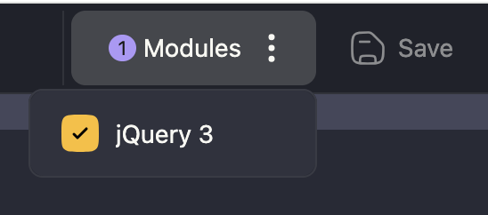

# Slack Access Hack

Slack Access Hack is a messy, always in-progress attempt to make Slack accessible and decluttered in the web browser. Optimized for low vision.


## Requirements

- [Google Chrome](https://www.google.com/chrome/)
- The [User JavaScript and CSS](https://chromewebstore.google.com/detail/user-javascript-and-css/nbhcbdghjpllgmfilhnhkllmkecfmpld) Chrome extension


## Installation

After installing Google Chrome and the User JavaScript and CSS extension, open the extension. You'll need to create a new "Rule" and copy over the code from GitHub. You can call the rule anything you'd like. I call mine "Accessible."

Make sure the rule is active. The toggle on the rule in the left sidebar should be on.

Click on the rule to open it, if you haven't already.

Make sure that jQuery 3 is enabled in Modules:


Make sure the following is set to URL pattern at the top:
```
https://app.slack.com/*
```

There should be two main panels. The leftmost is for JavaScript. The other is for CSS. What you need to do is delete any existing code there, and then copy over the code from GitHub.

| What | Where |
| ------ | ------ |
| JavaScript | [javascript.js](javascript.js) |
| CSS | [styles.css](styles.css) |

Use the Save button or Ctrl-S/Cmd-S.

Then go to your Slack client, reload, and be free!
[https://app.slack.com/client](https://app.slack.com/client) :rocket:

## License

The Unlicense